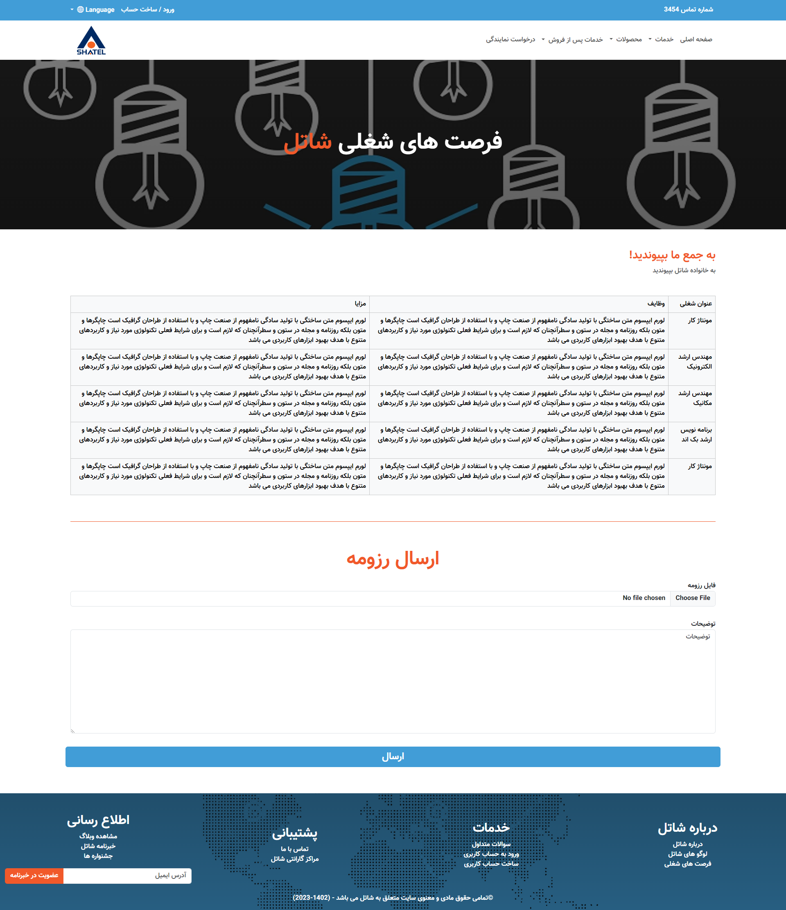

# Clone of Shatel.ir

 
 
Shatel is an Iranian Internet Service Provider and a "large" Local Internet registry based in Tehran, Iran . Shatel is the first ADSL2+ service provider in the country, and the first gigabit wireless network operator based on registered microwave frequency.

    python -m venv venv
    python3 -m venv venv
 

    pip install -r requirements.txt 
    pip3 install -r requirements.txt 

 

    flask db init 
    flask db migrate
    flask db upgrade

 

    ./scripts/runCelery.bat # for windows
    ./scripts/runCelery.sh # for linux & mac

 

    python app.py
    or
    flask run
    

